**完美嵌入项目，丢弃沉重的数据库操作软件，启动项目就可以对数据进行增删改查**

Sirvia是一套完备的在线增删改查系统，它舍弃了传统的通过Navicat或者PLSQL等软件操作数据库的方式，而是在项目内部嵌入了Sirvia，通过在网页端操作数据库，类似于Django的admin。

当Sirvia嵌入到项目中后，可以通过Generate类创建超级用户，通过账户跟密码登陆Sirvia，Sirvia使用shiro做用户认证，相对安全。登陆之后可以查看Sirvia的系统表，如果需要控制用户自己的表，需要将对应的实体类在Register类中进行注册，注册之后就可以登陆Sirvia对表进行增删改查的操作。

## 起步

### 1. 导入依赖

```xml
<dependency>
    <groupId>com.ericjin.javadmin</groupId>
    <artifactId>administration</artifactId>
    <version>1.0-SNAPSHOT</version>
</dependency>
```

使用Sirvia第一步需要导入对应的maven依赖

### 2.配置web.xml

由于Sirvia使用了shiro做认证，所以需要在web.xml中配置shiroFilter，当然由于Sirvia也使用了Spring跟SpringMVC，所以需要配置DispatcherServlet跟spring配置文件

```xml
<!-- 配置Spring Dispatcher Servlet -->
<servlet>
    <servlet-name>springMVC</servlet-name>
    <servlet-class>org.springframework.web.servlet.DispatcherServlet</servlet-class>
    <!-- spring mvc配置文件 -->
    <init-param>
        <param-name>contextConfigLocation</param-name>
        <param-value>/WEB-INF/dispatcher-servlet.xml</param-value>
    </init-param>
    <load-on-startup>1</load-on-startup>
</servlet>
<servlet-mapping>
    <servlet-name>springMVC</servlet-name>
    <url-pattern>/</url-pattern>
</servlet-mapping>


<listener>
    <listener-class>org.springframework.web.context.ContextLoaderListener</listener-class>
</listener>
<!-- 指定spring的配置文件 -->
<context-param>
    <param-name>contextConfigLocation</param-name>
    <param-value>/WEB-INF/applicationContext.xml</param-value>
</context-param>


<!--
 1. 配置  Shiro 的 shiroFilter.
 2. DelegatingFilterProxy 实际上是 Filter 的一个代理对象. 默认情况下, Spring 会到 IOC 容器中查找和
 <filter-name> 对应的 filter bean. 也可以通过 targetBeanName 的初始化参数来配置 filter bean 的 id.
 -->
<filter>
    <filter-name>shiroFilter</filter-name>
    <filter-class>org.springframework.web.filter.DelegatingFilterProxy</filter-class>
    <init-param>
        <param-name>targetFilterLifecycle</param-name>
        <param-value>true</param-value>
    </init-param>
</filter>
<filter-mapping>
    <filter-name>shiroFilter</filter-name>
    <url-pattern>/*</url-pattern>
</filter-mapping>
```

### 3.导入Sirvia的spring以及springMVC配置文件

分别找到当前项目的spring以及SpringMVC配置文件，并在其中导入Sirvia的相关配置文件，当然，如果你的项目只有一个spring的配置文件，也可以将两项配置全部导入到这一个spring配置文件中

`在当前项目的spring配置文件中导入Sirvia的spring配置文件（applicationContext.xml）`

```xml
<import resource="classpath*:adminApplicationContext.xml" />
```

`在当前项目的springMVC配置文件中导入Sirvia的springMVC配置文件（dispatcher-servlet.xml）`

```xml
<import resource="classpath*:springMVC-servlet.xml"/>
```

### 4.配置数据库

由于Sirvia是用于操作数据库的工具，所以需要连接你的数据库，因此需要在你项目的spring配置文件中配置数据库的相关信息。

在配置之前需要提一个东西，就是`CommonsSetting`类，这个类是用于你的项目与Sirvia进行通信的，所以数据库信息需要设置在这个类中，你可以自己新建一个类继承`CommonsSetting`类，也可以直接在Spring配置文件中配置这个类

```xml
<bean name="commonsSetting" class="com.ericjin.javadmin.CommonsSetting">
    <property name="dataBase">
        <map>
            <entry key="url" value="jdbc:mysql://127.0.0.1:3306/java_admin?serverTimezone=UTC"/>
            <entry key="password" value="root"/>
            <entry key="user" value="root"/>
            <entry key="driver" value="com.mysql.jdbc.Driver"/>
        </map>
    </property>
</bean>
```

注意bean的名称不要改变

### 5.导入templates目录

Sirvia的所有页面都存在于templates目录中，需要拿到这个目录后放到自己项目的WEB-INF目录下面

此时，启动项目如果成功，就表示已经引入Sirvia成功了

访问：`/admin/login`就可以来到登陆页面，如下

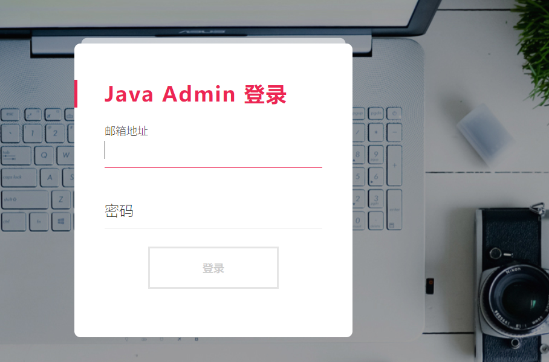

## 功能介绍

想要使用Sirvia，还需要有一个账户

### 1. 生成user表以及账户

想要进入Sirvia页面管理数据表需要登陆，那么首先需要创建账户，账户存储在数据库中，因此需要先创建用户表，具体的创建是在`Generate`类中完成的

在当前的项目中准备一个类，在类的`main`方法中执行`Generate`的`generateUserTable()`方法来创建用户表，方法需要传入数据库信息，按需传入即可。

```java
public class Test {
    public static void main(String[] args) {
        new Generate().generateUserTable("com.mysql.jdbc.Driver",
                "jdbc:mysql://127.0.0.1:3306/java_admin?serverTimezone=UTC",
                "root", "root");
    }
}
```

创建用户表后就需要创建账户了，还是在该类的`main`方法中执行`Generate`的`createUser()`方法，按照要求填写即可创建账户。

```java
public class Test {
    public static void main(String[] args) {
        new Generate().createUser("com.mysql.jdbc.Driver",
                "jdbc:mysql://127.0.0.1:3306/java_admin?serverTimezone=UTC",
                "root", "root");
}
```


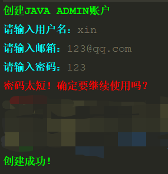

### 2. 登陆Java admin

启动项目后，通过地址`http://127.0.0.1:8080/admin/login`可以进入Sirvia的登陆页面，如下：


### 3. 操作数据表

登陆后会进入首页，首页展示如下：

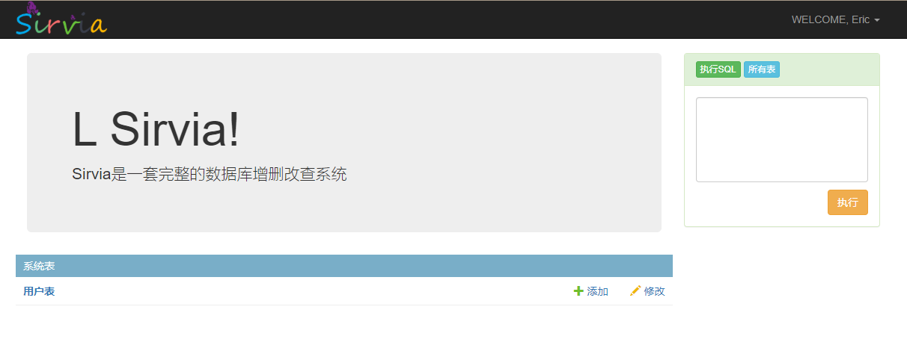

可以看到，首页有一个Panel，Panel的头部写着系统表，这是Sirvia系统自带的表，可以看到有一张用户表，这张表就是刚刚第二步通过`Generate`类创建的表，里面存储有用户信息，一般不是太会用到。那么如果想要操作自己的表应该怎么做呢？

在你的项目中能够被spring扫描的包内创建一个类，这里命名为`MyRegister`，它需要继承`Register`类，如果需要将自己的表交给Sirvia管理，需要重写`userTableList()`方法，在方法中接收父类方法的列表，将需要自己表对应的实体类的Class对象添加到这个列表中，然后将这个列表返回出去

```java
public class MyRegister extends Register {
    @Override
    public List<Class> userTableList() {
        List<Class> list = super.userTableList();
        list.add(Article.class);
        list.add(Tags.class);
        list.add(Test.class);
        return list;
    }
}
```

然后将该列表放到spring容器中，即在applicationContext.xml文件中加入如下代码

```xml
<!-- 这里的MyRegister就是刚刚创建的，包路径填写自己的 -->
<bean name="my_register" class="com.jinxin.MyRegister"/>
<!-- 这里注意名字不能改变，必须是userTableList -->
<bean name="userTableList" factory-bean="my_register" factory-method="userTableList"/>
```

在上面的代码中添加了三个实体类，注意添加的实体类一定要在数据库中有对应的表。

重启项目，然后来到首页：

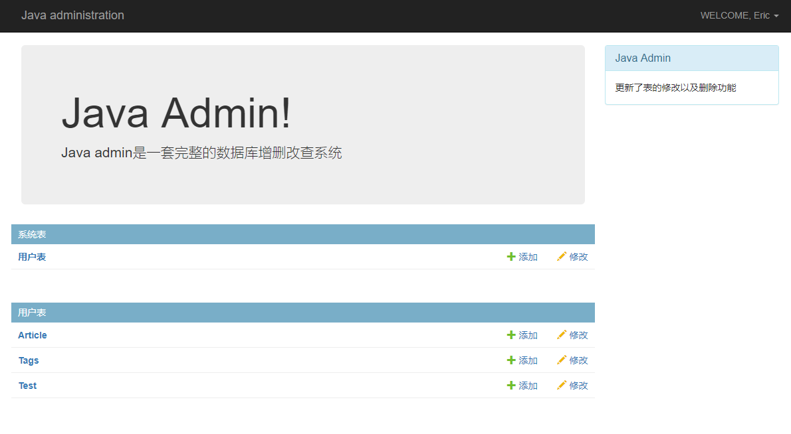

可以看到，刚刚添加的三个表已经在首页展示了

#### 查询数据

可以看到在系统表下面有了一个用户表，里面有三条信息，正是刚刚添加的三个实体类，可以点进去进行查看，例如现在点进`Article`中：

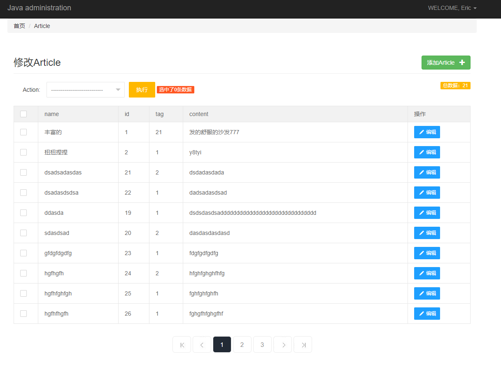

#### 添加数据

点进去后就是关于Article的所有数据了，在这里面可以针对每一条数据进行修改，也可以添加Article，只需要点击绿色的按钮即可，点击后会出现下面的页面：

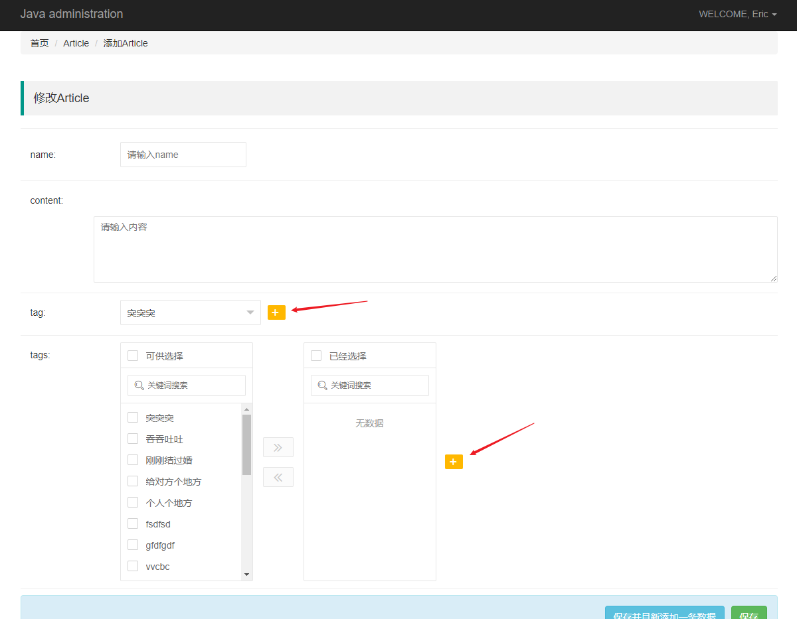

​	Sirvia会根据`Article`实体类中的所有私有属性进行表单渲染，表单类型会根据属性的类型来选择渲染，或input框，或select框，或radio框，或穿梭框等等。

​	如果在该实体类中有外键关联了其他的实体类，Sirvia会找到所关联的表的所有字段渲染成一个select框供选择，显示外键的属性上面需要标注`@ForeignKey`注解，在注解里面可以配置要显示的字段名以及要保存的外键value。如果是多对多，则会渲染成穿梭框，需要在属性上标注`@ManyToManyField`注解，注解里面的内容后面会详细说明。

​	在上图中可以看到不论是外键还是多对多的旁边都有一个添加按钮，点击这个按钮就可以往对应的关联表的中添加信息，例如上图中点击按钮就可以对tag表进行添加，如下：

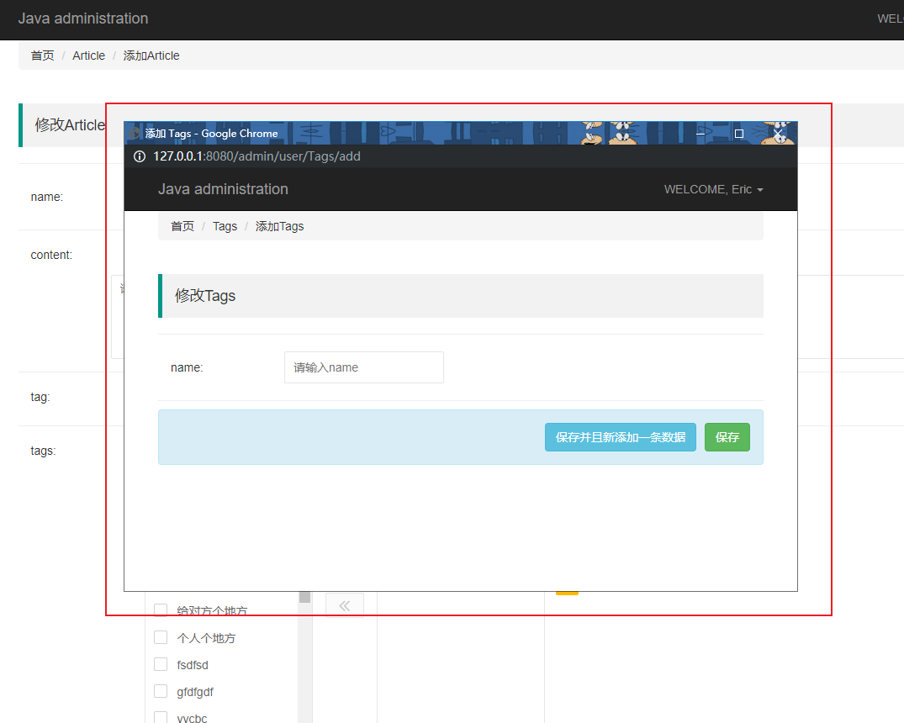

在上图中的红框中就是添加tag的页面，填写后保存即可。

#### 修改跟删除数据

再回到数据展示页面，可以看到在每一条数据后面都有一个编辑按钮，点击进入：


可以看到和添加表的页面基本没有差别，只是在每一个输入框中都已经填入了已经保存在数据库中的信息，还有就是在底部添加了一个删除按钮，点击删除就可以对该条数据进行删除，其他都与添加页面的功能保持一致。

#### Action

Action是一个可以对数据进行批量操作的功能，在数据展示页面，选中要批量操作的数据，然后在Action选框中选中要进行何种批量操作，最后点击执行即可。如下：

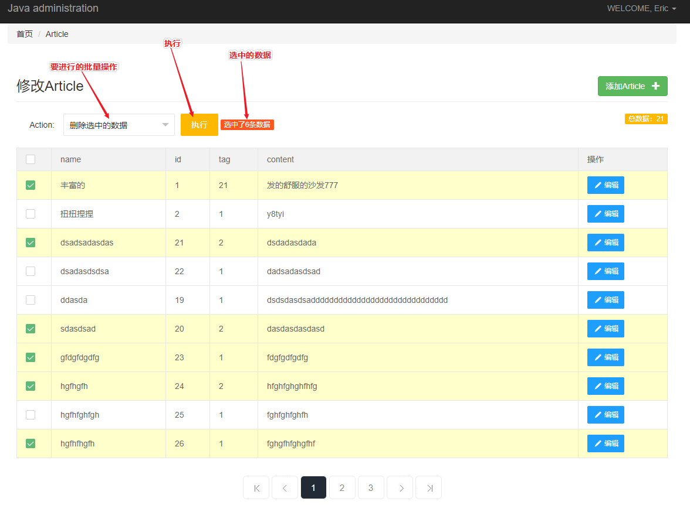

Sirvia系统只提供了一个批量删除的操作，如果需要实现其他的批量操作，可以在`Action`类中自己定义，关于自定义Action的具体内容会在后面说明。

## Sirvia注解

## 类注解

### EntityTableName

EntityTableName标注在实体类上面，它的作用是标明该实体类对应着数据库中的哪张表，如果不标注，Java Admin会按照实体类名的小写的方式确定表名，例如：`Article`会转换成`article`去数据库查询

### ShowName

这个注解的作用是为实体类重命名，在Java Admin中会按照实体类的名称来显示，如果希望显示自定义的名称，则可以通过该注解来实现。例如，现在在Java Admin中显示的名字是实体类名：


现在在Article类上面标注ShowName注解

```java
@ShowName(name = "文章表")
public class Article {}
```

再次来到首页查看：

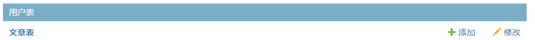

可以看到，现在显示的名称已经变成了刚刚在ShowName中注解的名称

## 字段注解

### Id

id注解起初出现的意义是为了屏蔽id字段，因为大多数情况下，id是自增的，因此并不需要自己填写，所以为了避免误填，可以在id字段上面标注`@Id`注解来屏蔽掉该字段，屏蔽后再添加或者修改数据就不会出现添加id的项了。当然这个注解并不仅仅是可以添加在id字段上，还可以添加在任何想要屏蔽的字段上。

### Password

该注解也是用于标注在字段上面的，一般标注在表示密码的字段上，表示在生成input框的时候type=password

### DateUse

该注解的作用与Password注解相似，一般标注在表示日期的字段上面，表示在生成input框的时候生成日期选择的输入框

### Choose

有的时候一些字段只有规定的几个值需要填，例如性别字段就只有男女两个选择，这个时候就可以使用`Choose`注解去规定生成select选择框。它有几个值需要填写：

* type：这个字段用于确定复选框的类型，有0跟1两个选择，默认为0，0表示生成radio框，1表示生成select框；
* valueList：选择框的value值；
* textList：选择框要显示的文字信息；

**type=0**

下面演示type=0的效果，也就是生成radio框

```java
@ShowName(name = "文章表")
public class Article {
	@Choose(valueList = {"0", "1"}, textList = {"男", "女"})
    public Integer gender;
}
```

生成的input框如下：

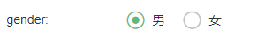

**type=1**

下面演示type=1的效果，也就是生成select框

```java
@ShowName(name = "文章表")
public class Article {
	@Choose(type = 1, valueList = {"0", "1"}, textList = {"男", "女"})
    public Integer gender;
}
```

生成的input框如下：

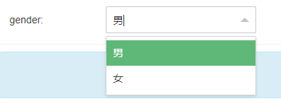

### ForeignKey

这个注解标注在表示外键的字段上面，标注该字段后，在添加或者编辑信息的时候会自动加载所关联的表的信息，以供选择。它有几个值需要填写：

* relation_table：这个值需要填写外键关联的表名；
* relation_key：外键关联的表的字段，默认是`id`，这个会作为select框的value值；
* show_field：想要显示关联表的哪一列的内容，这个会作为select框中的option标签体里的内容；
* relation_bean：关联的表对应的实体类；

**示例：**

```java
@ForeignKey(relation_table = "tags", relation_key = "id", show_field = "name", relation_bean = Tags.class)
private Integer tag;
```

生成的表单如下：

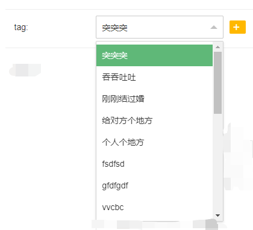

### ManyToManyField

这个注解标注在多对多关联的字段上，会显示一个穿梭框，它会自动加载第三张表的信息以供选择。它有几个值需要填写：

* relation_table：关联的表的表名；
* third_table：多对多会出现第三张表，这个字段填写第三张表的表名；
* show_field：想要显示关联表哪一列的内容；
* relation_field：关联表在第三张表中插入的内容，一般是关联表的`id`
* third_relation_field：关联表在第三张表中对应的字段，也就是说该字段是一个外键，关联着关联表的id(默认)
* third_self_field：当前表在第三张表中对应的字段，也就是说该字段是一个外键，关联着当前表的id(默认)
* insert_field：当前表在第三张表中插入的内容，一般是本表的`id`
* relation_bean：当前表关联的表所对应的实体类

**示例：**

```java
@ManyToManyField(relation_table = "tags", third_table = "tag_article", show_field = "name", relation_field = "id",
            third_relation_field = "tag_id", third_self_field = "article_id", relation_bean = Tags.class)
private List tags;
```

生成的穿梭框如下：

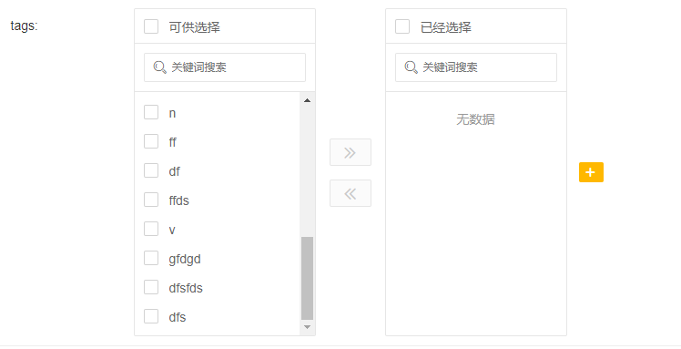

# Action

Sirvia还有一个比较重要的功能，就是对数据进行批量处理，在上面已经提到了批量删除一些字段，那么如果想要实现一些其他的批量操作的功能应该怎么办呢？

首先需要在自己的项目中创建一个`MyAction`类，该类需要继承`Action`类，在该类中定义需要批量执行的方法

```java
public class MyAction extends Action {
    public Boolean getNum(List<Integer> selectArr, String tableName, SuperMapper superMapper) {
        System.out.println("一共选中了" + selectArr.size() + "条数据");
        selectArr.forEach(System.out::println);
        return true;
    }
}
```

然后你需要让Sirvia知道你的Action的位置，告诉Sirvia位置后，Sirvia才能帮助你执行Action里面的方法

告诉Sirvia的方法就是自定义一个类继承`CommonsSetting`类，重写`actionPackage()`方法，将自定义的Action类的路径返回出去

```java
public class MyCommonsSetting extends CommonsSetting {
    @Override
    public String actionPackage() {
        return "com.jinxin.MyAction";
    }
}
```

将该类注册到Spring容器中，不过在开始配置数据库的时候就已经将该类注册到了容器中了，但是如果在配置数据库的时候不是使用的自定义的类而是使用Sirvia提供的`CommonsSetting`类的话就需要在这里进行替换，替换为自己的类

```xml
<bean name="commonsSetting" class="com.jinxin.MyCommonsSetting">
    <property name="dataBase">
        <map>
            <entry key="url" value="jdbc:mysql://127.0.0.1:3306/java_admin?serverTimezone=UTC"/>
            <entry key="password" value="root"/>
            <entry key="user" value="root"/>
            <entry key="driver" value="com.mysql.jdbc.Driver"/>
        </map>
    </property>
</bean>
```

除此之外，还需要将刚刚的批量操作展示在页面上，这需要你去`MyRegister`类中重写`actionMap()`方法，继承父类的map，然后将刚刚定义的批量删除的方法名跟要展示在页面上的操作名称放入map中，然后返回出去

```java
@Override
public Map<String, String> actionMap() {
    Map<String, String> map = super.actionMap();
    map.put("getNum", "打印所选数据的信息");
    return map;
}
```

然后将map放到spring容器中

```xml
<bean name="my_register" class="com.jinxin.MyRegister"/>
<bean name="actionMap" factory-bean="my_register" factory-method="actionMap"/>
```

现在重启项目来到数据展示页：

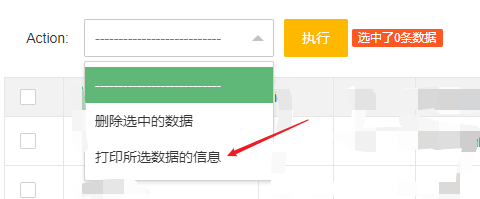

现在选中执行：

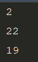

成功打印所选数据的id信息

# 执行SQL

## 获取所有的表名

在Java Admin的首页右侧还提供了两个功能，一个是获取当前连接的数据库的所有表名

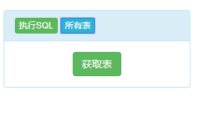

点击获取表即可获取数据

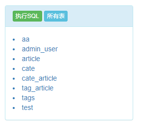

## 执行SQL

如果需要创建表，可以到执行sql的面板执行创建表的操作

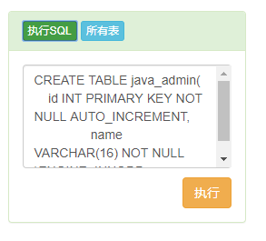

将sql数据textarea中，然后点击执行即可


 